# Workshop 2 — Containerizing and Deploying a Java Web Application

## Purpose
This project explores virtualization as an architectural mechanism for modularity,
isolation, portability, and deployment. It builds a small Java web application with
Spring Boot, packages it as a Docker image, runs multiple isolated container instances
locally (including a multi-container setup with Docker Compose), publishes the image
to Docker Hub, and deploys it on an AWS EC2 virtual machine. It also analyzes the cost
of that deployment model across different workload levels.

## Technology stack
- Java 21 LTS
- Maven
- Spring Boot 4.1.1
- Docker Desktop + Docker Compose v2
- Docker Hub
- Amazon Linux 2023 on AWS EC2
- Amazon Corretto 21 (Docker base image)

## Architecture and class design
- **`Workshop2Application`** — application entry point. Reads the listening port from
  the `PORT` environment variable, defaulting to `9000` if not set.
- **`HelloRestController`** — exposes `GET /greeting?name=X`, returning `Hello, X!`.

## Part 1 — Build and run locally

```bash
mvn clean package
java -jar target/workshop2-0.0.1-SNAPSHOT.jar
```

Verify:

http://localhost:9000/greeting?name=Pedro

Expected response: `Hello, Pedro!`

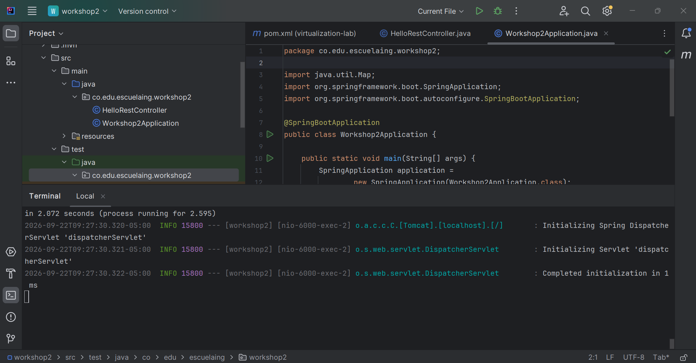

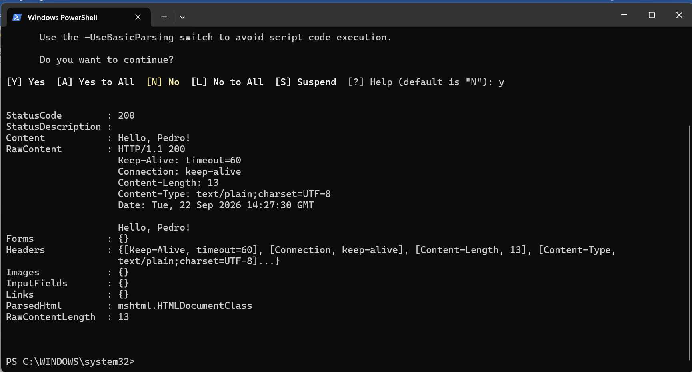

## Part 2 — Containerize and run with Docker

**Dockerfile:**
```dockerfile
FROM amazoncorretto:21
WORKDIR /app
COPY target/*.jar app.jar
ENV PORT=9000
EXPOSE 9000
ENTRYPOINT ["java", "-jar", "app.jar"]
```

**Build the image:**
```bash
docker build -t sbarros2121/workshop2:1.0 .
docker images
```

**Run a single container:**
```bash
docker run -d --name workshop2-1 -e PORT=9000 -p 34000:9000 sbarros2121/workshop2:1.0
docker ps
curl http://localhost:34000/greeting?name=Container
```

**Demonstrate container isolation (three independent instances of the same image):**
```bash
docker run -d --name workshop2-2 -p 34001:9000 sbarros2121/workshop2:1.0
docker run -d --name workshop2-3 -p 34002:9000 sbarros2121/workshop2:1.0

curl http://localhost:34000/greeting?name=Container1
curl http://localhost:34001/greeting?name=Container2
curl http://localhost:34002/greeting?name=Container3
```
Each container responds independently, confirming isolation between instances started
from the same image.

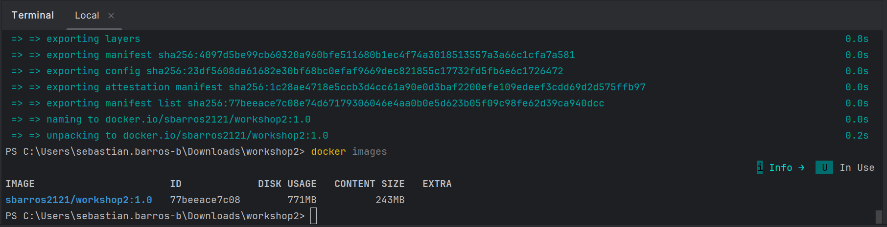

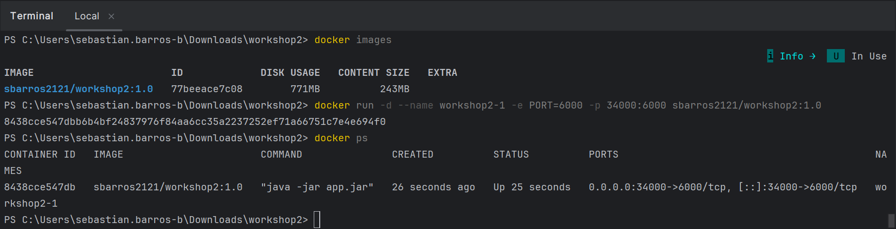

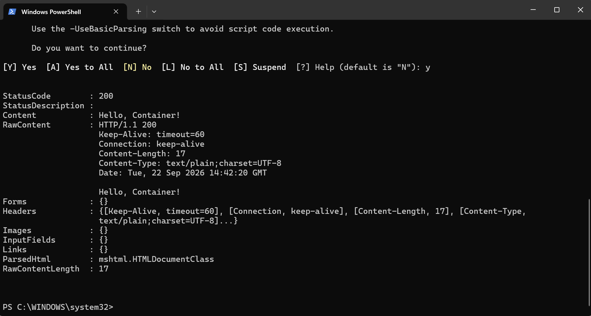

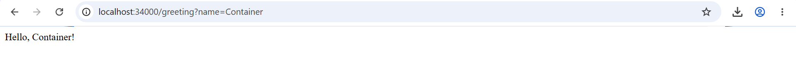

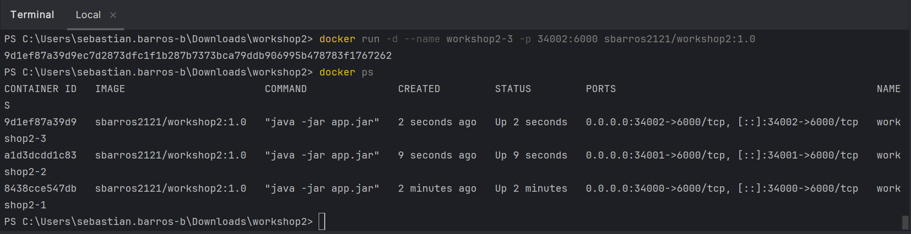

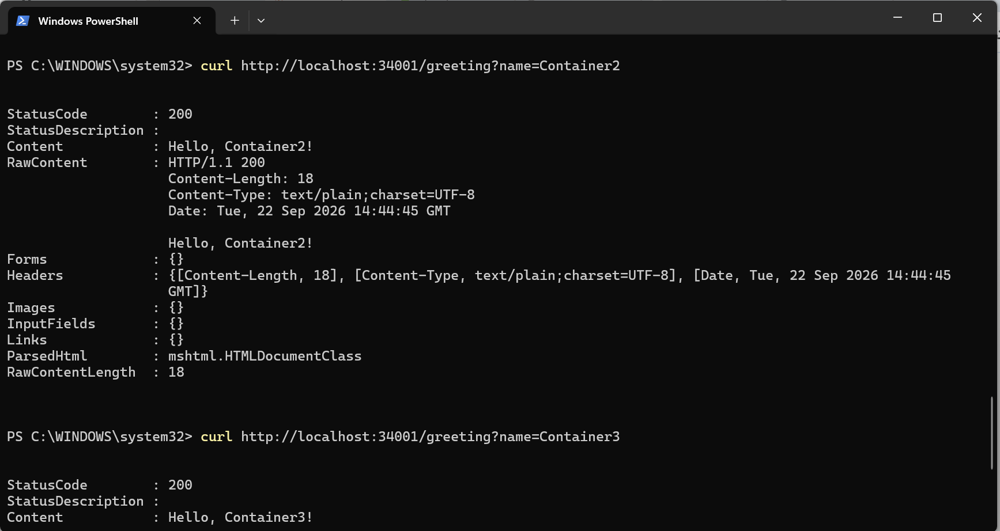

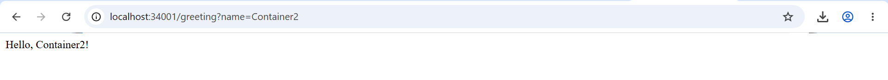

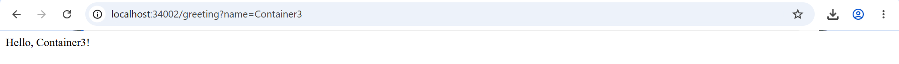

## Part 3 — Multi-container environment with Docker Compose

**compose.yaml:**
```yaml
services:
  web:
    build:
      context: .
      dockerfile: Dockerfile
    container_name: virtualization-web
    environment:
      PORT: 9000
      SPRING_DATA_MONGODB_URI: mongodb://db:27017/workshop
    ports:
      - "8087:9000"
    depends_on:
      - db

  db:
    image: mongo:8
    container_name: virtualization-db
    volumes:
      - mongodb:/data/db
      - mongodb_config:/data/configdb
    ports:
      - "27017:27017"
    command: mongod

volumes:
  mongodb:
  mongodb_config:
```

**Run:**
```bash
docker compose up -d --build
docker compose ps
docker compose logs web
docker compose logs db
curl http://localhost:8087/greeting?name=Compose
```

**Verify inter-container communication:**
```bash
docker compose exec db mongosh
```
```javascript
show dbs
use workshop
db.messages.insertOne({ message: "Hello from Docker Compose" })
db.messages.find()
exit
```

The `web` service can reach MongoDB through the hostname `db` — the Compose service
name — over the network Compose creates automatically. The application does not yet
persist data to MongoDB (no Spring Data MongoDB dependency or repository code); this
section demonstrates Compose's multi-service orchestration, networking, and volume
management as specified by the workshop.

**Stop while preserving data:**
```bash
docker compose down
```

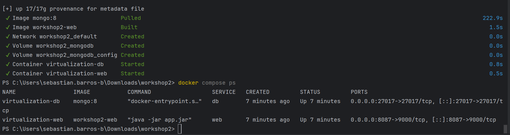

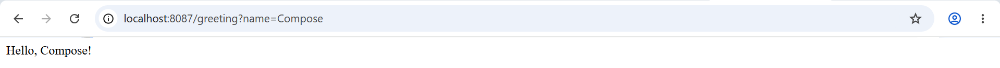

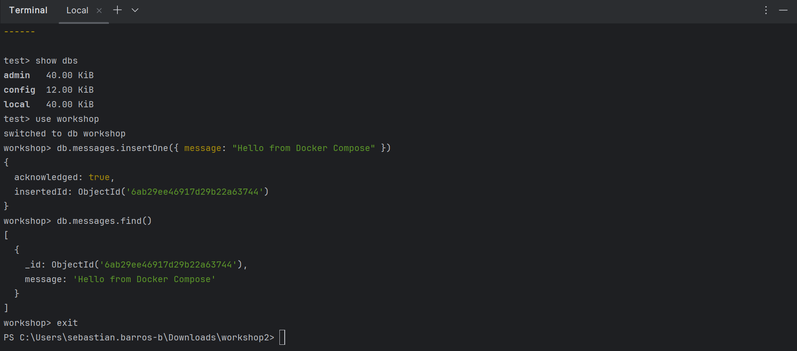

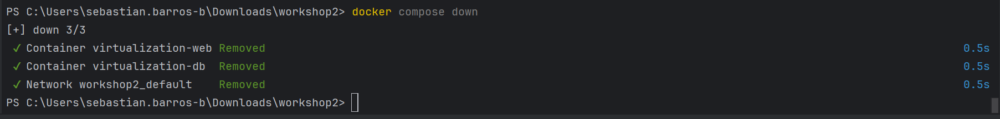

## Part 4 — Publish to Docker Hub

```bash
docker login
docker tag sbarros2121/workshop2:1.0 sbarros2121/workshop2:latest
docker push sbarros2121/workshop2:1.0
docker push sbarros2121/workshop2:latest
```

**Docker Hub repository:** https://hub.docker.com/r/sbarros2121/workshop2

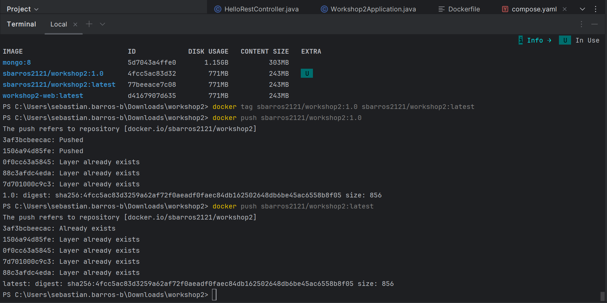

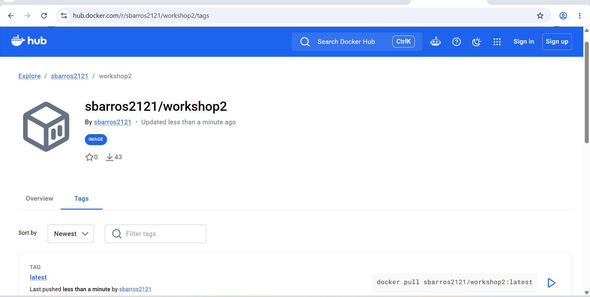

## Part 5 — Deploy on AWS EC2

1. Launched an **Amazon Linux 2023** EC2 instance (`t3.micro`).
2. Security group:
    - SSH (22) restricted to my public IP only.
    - Custom TCP (8080) open to `0.0.0.0/0` so the deployment can be verified publicly.
3. Connected via SSH and installed Docker:
```bash
   sudo yum update -y
   sudo yum install -y docker
   sudo service docker start
   sudo usermod -a -G docker ec2-user
```
4. Reconnected, then pulled and ran the published image:
```bash
   docker pull sbarros2121/workshop2:1.0
   docker run -d \
     --name workshop2 \
     --restart unless-stopped \
     -e PORT=9000 \
     -p 8080:9000 \
     sbarros2121/workshop2:1.0
```
5. Verified:
```bash
   docker ps
   docker logs workshop2
```

**Public deployment URL:** http://ec2-54-88-62-153.compute-1.amazonaws.com:8080/greeting?name=AWS

Expected response: `Hello, AWS!`

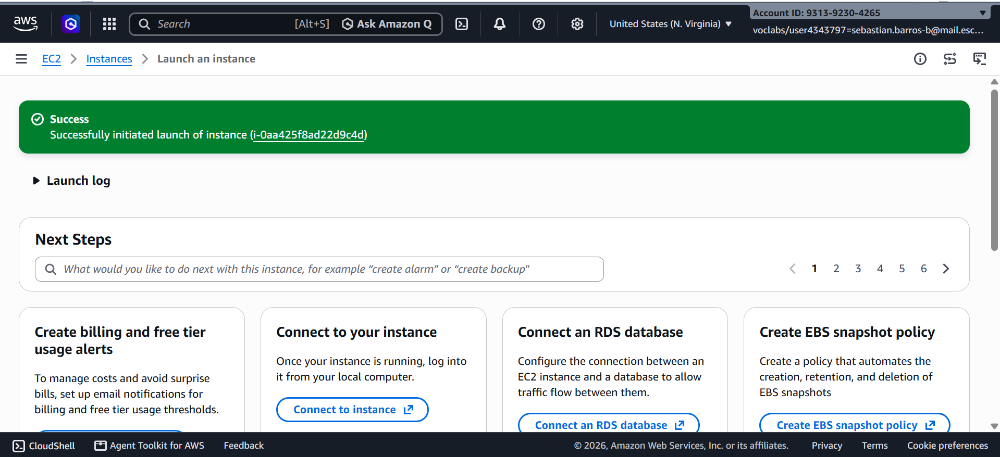

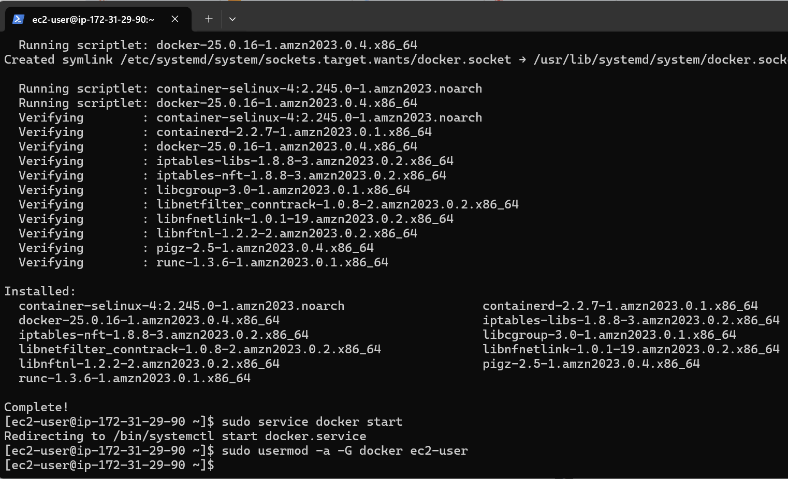

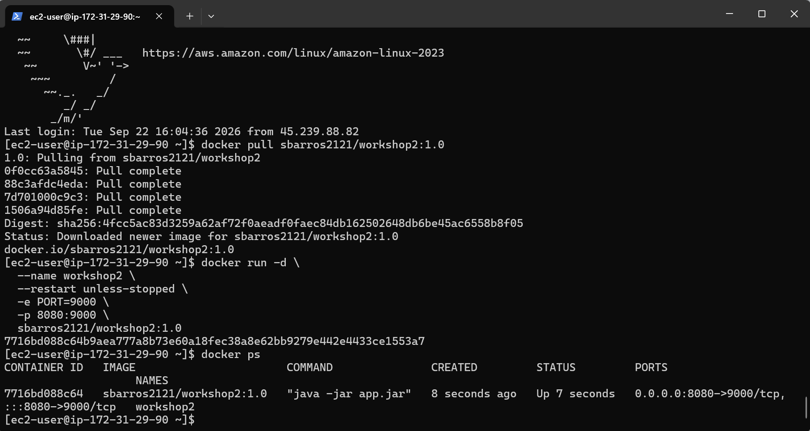

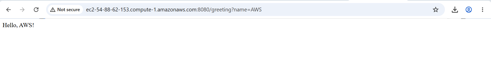

## Part 6 — Deployment model and cost analysis

### Deployment model

Client
↓ HTTP request
EC2 virtual machine
↓
Docker Engine
↓
Java web application container


- **EC2 virtual machine:** isolated compute, memory, storage, and network resources
  rented by the hour.
- **Docker container:** a portable execution environment containing the application
  and its runtime dependencies.
- **Java web application:** receives HTTP requests and provides the business
  functionality.
- **Security group:** controls which inbound traffic can reach the virtual machine.

### Workload assumptions

| | Small (10K req/mo) | Medium (100K req/mo) | Large (1M req/mo) |
|---|---|---|---|
| AWS Region | US East (N. Virginia) | US East (N. Virginia) | US East (N. Virginia) |
| EC2 instance type | t3.micro | t3.small | t3.medium |
| Number of instances | 1 | 1 | 2 |
| Monthly runtime | 730 hrs (24/7) | 730 hrs (24/7) | 730 hrs × 2 (24/7) |
| EBS storage | 8 GB gp3 | 8 GB gp3 | 16 GB gp3 (per instance) |
| Avg. request/response size | ~1 KB | ~1 KB | ~1 KB |
| Runs continuously or scheduled | Continuously | Continuously | Continuously |
| Requires high availability | No | No | Yes |

Outbound data transfer is not itemized separately: given the small response payload
size (~1 KB) and AWS's 100 GB/month free tier for outbound EC2 traffic, transfer costs
are negligible across all three scenarios.

### Cost estimate

Estimated using the [AWS Pricing Calculator](https://calculator.aws/) (On-Demand
pricing, 100% monthly utilization, Shared tenancy, Linux).

| Scenario | Monthly requests | Monthly infrastructure cost | Estimated cost per request | Main cost drivers |
|---|---|---|---|---|
| Small workload | 10,000 | $8.23 | $0.000823 | EC2 compute (t3.micro) + EBS storage |
| Medium workload | 100,000 | $15.82 | $0.0001582 | EC2 compute (t3.small) + EBS storage |
| Large workload | 1,000,000 | $63.30 | $0.0000633 | 2× EC2 t3.medium (HA) + larger EBS |

*(Cost per request = monthly infrastructure cost / monthly requests)*

**AWS Pricing Calculator evidence:**

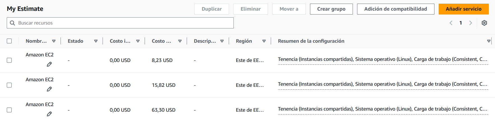

### Architectural discussion

**Why does an EC2-based deployment have a baseline monthly cost even when the
application receives few requests?**
Because EC2 bills for the time an instance is running (compute hours) and for the EBS
storage provisioned, regardless of how much traffic it actually receives. The
instance, disk, and reserved IP keep consuming billed resources even when idle.

**At which workload level does the fixed cost become less significant per request?**
At the large-workload level (1,000,000 requests/month), the fixed monthly cost is
spread across far more requests, driving the cost per request down sharply. At the
small-workload level (10,000 requests/month), that same fixed cost dominates the
calculation, producing a much higher cost per request.

**What would force a move from one EC2 instance to multiple instances?**
Running out of CPU/memory capacity to handle concurrent request volume, needing high
availability (avoiding a single point of failure), or needing zero-downtime rolling
deployments.

**Which additional services would a production deployment likely require?**
An Application Load Balancer, a managed database (RDS or DocumentDB instead of Mongo
in a container), a container registry (Amazon ECR instead of Docker Hub), monitoring
(CloudWatch), automated backups, and likely an Auto Scaling Group.

**Would a serverless deployment be more cost-effective for the small-workload
scenario?**
Likely yes. At only 10,000 requests/month, traffic is sparse and unpredictable, so an
EC2 model — billed for 730 fixed hours/month regardless of usage — wastes most of the
capacity it pays for. A serverless model (AWS Lambda + API Gateway) charges only for
actual invocations and execution time, with no cost during idle periods, which fits
low, uneven traffic far better. As volume grows and becomes steady (as in the large
workload), a continuously-running EC2 instance becomes more cost-effective than paying
per invocation.

### Conclusion
For the small and medium workloads, EC2's fixed 24/7 cost is harder to justify given
how little of that capacity is actually used — a serverless approach would likely be
cheaper and simpler to operate at that scale. EC2 becomes clearly appropriate at the
large-workload level, where sustained, high-volume traffic justifies dedicated,
continuously-running compute and the added control it provides over the runtime
environment.

## Links
- **Docker Hub:** https://hub.docker.com/r/sbarros2121/workshop2
- **Public deployment URL:** http://ec2-54-88-62-153.compute-1.amazonaws.com:8080/greeting?name=AWS